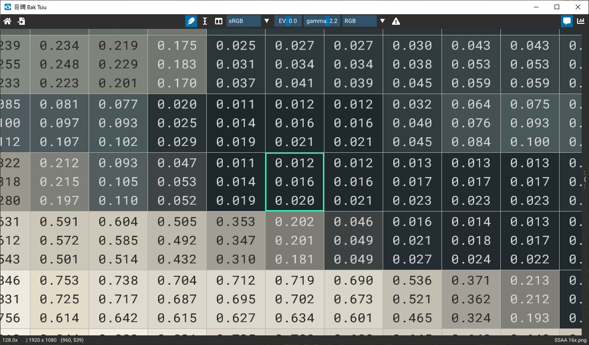
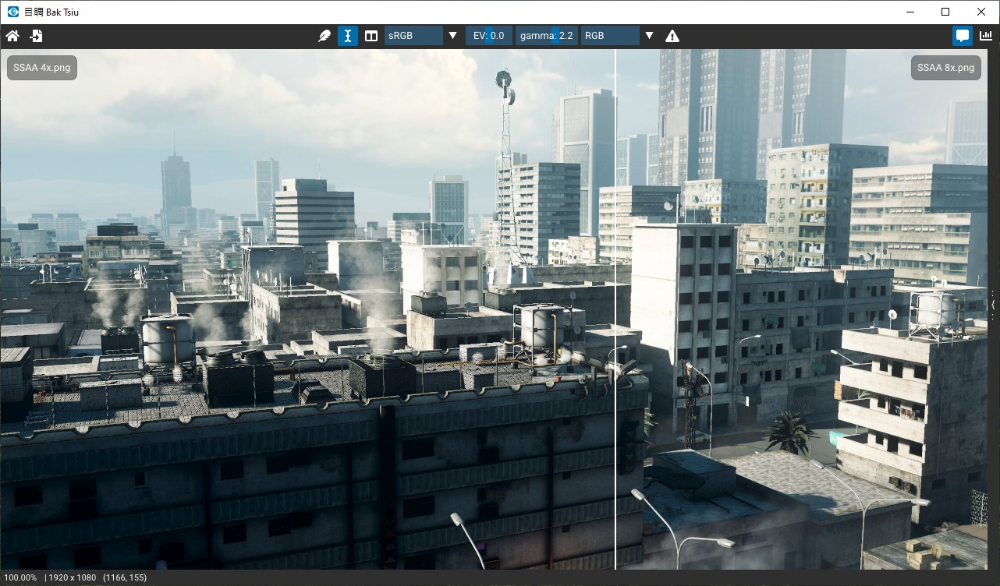
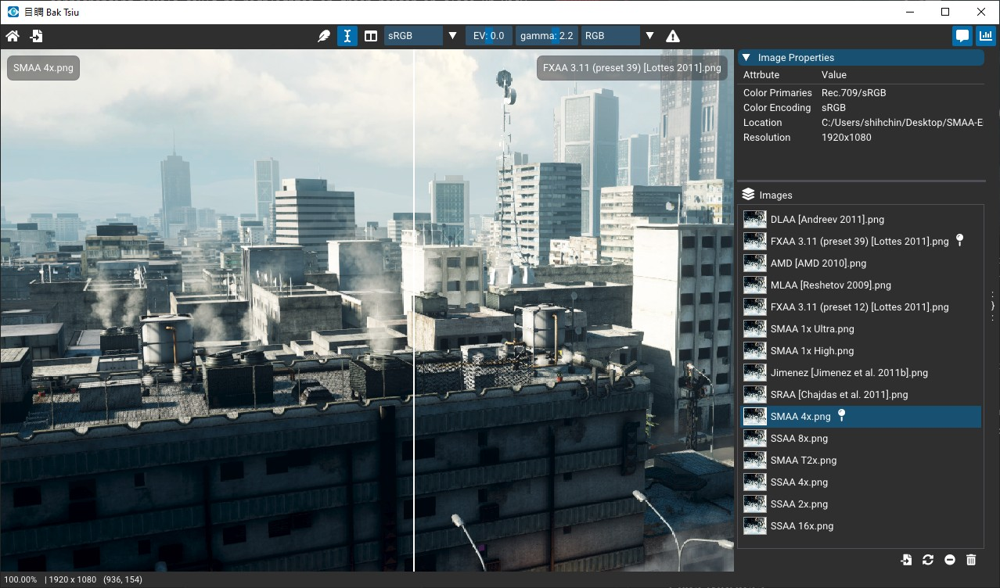
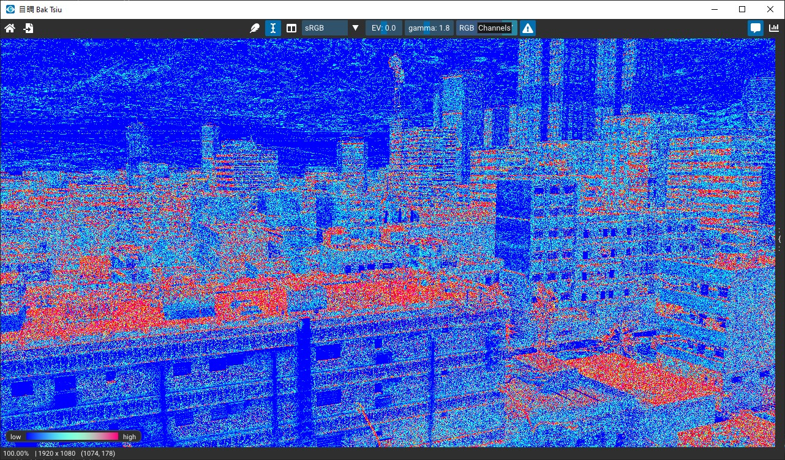

<link rel="stylesheet" href="https://pro.fontawesome.com/releases/v5.10.0/css/all.css" integrity="sha384-AYmEC3Yw5cVb3ZcuHtOA93w35dYTsvhLPVnYs9eStHfGJvOvKxVfELGroGkvsg+p" crossorigin="anonymous"/>

# Bak-Tsiu Quickstart Guide

When comparing render results from different anti-aliasing or importance sampling algorithms, I found there are no convenient tools for examining pixel differences among multiple images. Bak-Tsiu is created to meet the needs of fast pixel navigation, it's a tool derived from my personal workflow. If you are looking for a tool to compare several similar images. Hope Bak-Tsiu would be also a helpful tool for you.

> The sample images used in the following figures are downloaded from the [supplementary material](http://www.iryoku.com/smaa/) of *SMAA: Enhanced Subpixel Morphological Antialiasing*, Jimenez et al., 2012.

## Basic Navigation

* Pan View: drag left mouse button
* Zoom In/Out: <kbd>+</kbd>/<kbd>-</kbd> or scroll mouse wheel
* Continuous Zooming: drag left and right mouse buttons vertically
* Zoom to Actual Size: <kbd>F</kbd>
* Fit Image to Viewport: <kbd>Shift+F</kbd>
* Pixel Sniper: holding <kbd>Z</kbd>

> The RGB values shown in close-up view are in **linear encoded ACES AP1** color space. The values would be affected by any stage before output device transformation. For more information about the color processing pipeline, please refer to this introductory [blog post](https://blog.frame.io/2019/09/09/aces/) about the Academy Color Encoding System ([ACES](https://github.com/ampas/aces-dev)).

## Image Comparison Slider <i class="fas fa-i-cursor"></i>

Press <kbd>S</kbd> or <i class="fas fa-i-cursor"></i> button to toggle split view.

## Side-by-Side Navigation <i class="fas fa-columns"></i>

Press <kbd>C</kbd> or <i class="fas fa-columns"></i> button to toggle side-by-side view for pixel navigation. 

The corresponding pixels would be highlighted in green border in close-up view. If there is no highlighted border shown in another view, please move the splitter to make more space and pan the view to the region of interests.

## Image Layers <i class="fas fa-layer-group"></i>

Press <kbd>Tab</kbd> key or click <i class="fas fa-chart-bar"></i> button to toggle property window. Click left mouse button on the image item to display it on the left; click right mouse button for the displayed image on the right.

To switch the image on the right, press
* <kbd>D</kbd> or <kbd>&rarr;</kbd> to next image in the list 
* <kbd>A</kbd> or <kbd>&larr;</kbd> to previous image in the list
* <kbd>X</kbd> or <kbd>&uarr;</kbd> to exchange left and right images

The basic image screening idea is to **put the image you like better on the left**, one recommended workflow is:

1. Drop all images into viewport or click <i class="fas fa-file-import"></i> to import images
2. Open image layers <i class="fas fa-chart-bar"></i> and select the first two images
3. If the right image is better than the left one, press <kbd>X</kbd> or <kbd>&uarr;</kbd> to exchange them
4. Press <kbd>D</kbd> or <kbd>&rarr;</kbd> to put next candidate on the right
5. Back to step 3 until the last image is shown

> For blind test, just toggle <i class="fas fa-comment-alt"></i> button at top-right corner to hide image names in viewport.

## Pixel Warning Markers <i class="fas fa-exclamation-triangle"></i>

Pixel warning markers are used to highlight problematic pixels. The option menu is invoked via right mouse click on <i class="fas fa-exclamation-triangle"></i> button.

Color difference of two corresponding pixels are computed in [Lab color space](https://en.wikipedia.org/wiki/CIELAB_color_space). There are two visualization options:

* Difference: highlight different pixels with magenta color

* Diff as Heatmap: map color distance to a color ramp (from blue to magenta)

Range clipping detection (not shown in heatmap mode):

* Shadow clipping (blue mark): if all RGB values < 0.00001
* Highlight clipping (red mark): if all RGB values > 1.0

## Controls

|To do this|Press|
|-|-|
| Show Home Window | <kbd>F1</kbd> |
| Toggle Property Window | <kbd>Tab</kbd> |
| Toggle Split View | <kbd>S</kbd> |
| Toggle Side-by-Side Column View | <kbd>C</kbd> |
| Toggle Pixel Warning Markers | <kbd>W</kbd> |
| Toggle Linear Image Filter | <kbd>Q</kbd> |
| **Files** |
| Import Images | <kbd>Ctrl+O</kbd> |
| Reload Selected Image | <kbd>F5</kbd> |
| Close Selected Image | <kbd>Backspace</kbd> or <kbd>Del</kbd> |
| Close All Images | <kbd>Ctrl+Shift+W</kbd> |
| **Pixel Navigation** |
| Pan View | Drag Left Mouse Button |
| Zoom In/Out | Scroll Mouse or Drag Left + Right Mouse Buttons Vertically |
| Zoom In/Out in Power-of-Two | <kbd>+</kbd> / <kbd>-</kbd> |
| Zoom to Actual Size | <kbd>/</kbd> or <kbd>F</kbd> |
| Fit to Viewport | <kbd>Shift+F</kbd> |
| Pixel Sniper | Holding <kbd>Z</kbd> |
| **Image Selection** |
| Next Compared Image | <kbd>D</kbd> or <kbd>&rarr;</kbd> |
| Previous Compared Image | <kbd>A</kbd> or <kbd>&larr;</kbd> |
| Exchange Compared Images | <kbd>X</kbd> or <kbd>&uarr;</kbd> |
| Set Left Compared Image | Click Left Mouse Button on the Image Item |
| Set Right Compared Image | Click Right Mouse Button on the Image Item |

## Supported Image Formats

* BMP
* GIF
* HDR
* JPG
* OpenEXR
* PNG